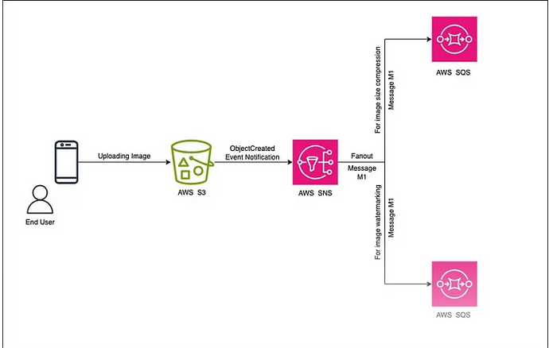

# SNS-SQS
When we save any data to an AWS S3 bucket, a notification is sent to clients via SNS and SQS through Terraform.

### *What is SNS and SQS ?*
  - Amazon Simple Notification Service is a notification service provided as part of Amazon Web Services since 2010. It provides a service for sending messages. Amazon SNS acts
  as a single message bus that can message to a variety of devices and platforms.
  
  - Amazon Simple Queue Service is a distributed message queuing service introduced by Amazon.com as a beta in late 2004, and generally available in mid 2006. It supports programmatic 
sending of messages via web service applications as a way to communicate over the Internet.

### Architecture of this small setup...

### Terraform phases

